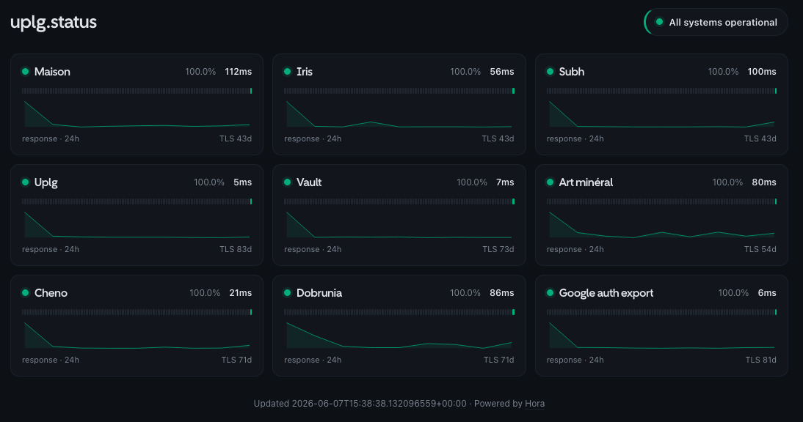

# Hora

[](https://github.com/uplg/hora/actions/workflows/ci.yml)
[](https://github.com/uplg/hora/pkgs/container/hora)
[](LICENSE)


A tiny, self-hosted uptime monitor written in Rust. One small binary probes your
services, stores history in SQLite, alerts you when something breaks (or a TLS
certificate is about to expire), and serves a server-rendered status page plus a
JSON API. The Docker image is a static musl binary on Alpine — about 15 MB.

Named after the **Horai**, the Greek goddesses of the hours.



## Features

- **HTTP, TCP, push & assertion probes** — per-monitor interval, timeout, expected
  status and a "degraded if slower than" threshold. HTTP monitors can assert a
  **keyword** in the body or a **JSONPath** (`json_query` / `json_expected`), route
  through an HTTP/SOCKS **proxy**, and send custom headers. **Push** (heartbeat)
  monitors flip to down when a job stops pinging `/api/push/{id}`.
- **Server-rendered status page** (no JavaScript framework): a compact, responsive
  grid — daily uptime bars, an inline SVG latency chart, **p95/p99 latency** with an
  optional **latency SLO** indicator, plus an **incidents/announcements** banner.
- **JSON API** to read status and latency history from anywhere, with a generated
  **OpenAPI 3.1** document at `/api/openapi.json`.
- **TLS certificate expiry monitoring** with advance warnings.
- **Pluggable notifications** via a `Notifier` trait — **Telegram, Discord, Slack, a
  generic JSON webhook and SMTP e-mail** built in. Channels are **named**, so you can
  have several of the same type and **route each monitor** to specific ones
  (`notify = [...]`). Alerts fire only after _N_ consecutive failures (so flapping
  never wakes you up) and include a snippet of the failing response body.
- **Scheduled maintenance windows** that mute alerts (per monitor or global).
- **Per-IP API rate limiting** on the JSON endpoints, with a configurable trusted
  client-IP header (e.g. `cf-connecting-ip` behind Cloudflare).
- **Live config reload**: edit `config.toml` (or send `SIGHUP`) and monitors,
  thresholds, retention _and notification channels_ are reconciled in place —
  existing checks never pause, so there is no blind window.
- **Per-monitor retention** with automatic pruning; the database does not grow
  forever.
- **`${VAR}` interpolation** in the config so secrets stay in the environment.
- Single self-contained binary: migrations and templates are compiled in.

## Quick start (Docker)

```sh
mkdir -p hora-config && cp config.example.toml hora-config/config.toml
# edit hora-config/config.toml

docker run -d --name hora --restart unless-stopped \
  -p 8787:8787 \
  -v "$PWD/hora-config:/etc/hora" \
  -v hora-data:/data \
  ghcr.io/uplg/hora:latest
```

The status page is at `http://localhost:8787/`. Put it behind your reverse proxy
on whatever domain you like — Hora is self-contained and assumes nothing about who
consumes it.

Secrets are best kept in the environment: any `${VAR}` in the config is replaced
from the environment at load. So in the file:

```toml
[[channels]]
name = "ops"
type = "telegram"
token = "${HORA_TELEGRAM_TOKEN}"
chat_id = "123456"
```

and on the container: `-e HORA_TELEGRAM_TOKEN=123:abc`. Only `HORA_BIND`,
`HORA_DATABASE_PATH` and `HORA_CONFIG` are read directly from the environment.

## Upgrade

```sh
docker pull ghcr.io/uplg/hora:latest
docker stop hora && docker rm hora
docker run -d --name hora --restart unless-stopped \
  -p 8787:8787 \
  -v "$PWD/hora-config:/etc/hora" \
  -v hora-data:/data \
  ghcr.io/uplg/hora:latest
```

Your history lives on the `hora-data` volume and survives upgrades.

### Upgrading from 0.1.x → 0.2

Notification config moved from per-type singletons to **named channels**, so you
can run several of the same type and route monitors to specific ones. The fixed
`HORA_*` secret variables are replaced by `${VAR}` interpolation.

```toml
# 0.1.x                              # 0.2
[telegram]                           [[channels]]
token = "…"   # or HORA_TELEGRAM_…   name = "telegram"
chat_id = "…"                        type = "telegram"
                                     token = "${HORA_TELEGRAM_TOKEN}"   # same env var still works
                                     chat_id = "…"
```

`HORA_BIND` / `HORA_DATABASE_PATH` are unchanged. If you run the container as the
non-root user for the first time on an existing volume, fix its ownership once:
`docker run --rm -v hora-data:/data alpine chown -R 10001:10001 /data`.

## Configuration & live reload

See [`config.example.toml`](config.example.toml) for every option. The file is
read from `$HORA_CONFIG` (default `./config.toml`).

To add, remove or change a monitor **without downtime**, just edit the config:

- **Bare metal / mounted directory:** Hora watches the file and reloads
  automatically.
- **Anywhere:** `kill -HUP <pid>` — or in Docker, `docker kill -s HUP hora`.

On reload, unchanged monitors keep running untouched; only new/removed/changed
ones are started or stopped, and the notification channels are rebuilt — so
adding a Telegram token takes effect live too. Only `server.bind` and the API
rate-limit settings are read once at startup and still require a restart.

## JSON API

| Endpoint | Description |
| --- | --- |
| `GET /` | The HTML status page. |
| `GET /api/summary` | All monitors: status, 24h uptime (per-mille), p50/p95/p99 latency, cert days left, daily history; plus active incidents. |
| `GET /api/monitors/{id}/latency?hours=24` | Latency samples `[{ "t", "latency_ms" }]` (404 if unknown). |
| `POST /api/push/{id}?token=…` | Record a heartbeat for a push monitor. Optional `status=up\|down\|degraded`, `msg`, `ping`. 401 on a wrong token, 404 if not a push monitor. |
| `GET /api/badge/{id}/status` | Embeddable SVG status badge for a monitor. |
| `GET /api/badge/{id}/uptime` | Embeddable SVG 24h-uptime badge for a monitor. |
| `GET /api/openapi.json` | The OpenAPI 3.1 spec, generated from the code (`utoipa`). |
| `GET /healthz` | Liveness probe. |

The `/api/*` endpoints (summary, latency, push) are **rate-limited per client IP**
(configurable; read once at startup) and send `x-ratelimit-*` / `retry-after`
headers; the badges and `/api/openapi.json` are not. The client IP is taken from
`X-Forwarded-For` / `X-Real-IP` by default, so run Hora behind a proxy that sets
it — a direct client could otherwise spoof it. Behind Cloudflare, set
`server.client_ip_header = "cf-connecting-ip"` and lock the origin to Cloudflare.
`allowed_origins` controls CORS (empty = allow any, since the data is read-only and
public). Responses carry a strict CSP and `X-Content-Type-Options: nosniff`.

Point any client (Bruno, Insomnia, Scalar, Swagger Editor…) at `/api/openapi.json`.

### Badges

Embed a monitor's live status and 24h uptime in a README, by its config `id`:

```md


```

Flat shields-style SVGs: green when up / uptime is high, amber for minor
incidents, red for an outage. A 404 is returned for an unknown id.

## Architecture

A small Cargo workspace:

- **`hora-notify`** — the `Notifier` trait, `Event` type, `Dispatcher`, and the
  Telegram / Discord / Slack / webhook / SMTP implementations. Add a channel by
  implementing the trait.
- **`hora-core`** — configuration, probing, SQLite storage, TLS-expiry checks, the
  per-monitor scheduler, and the supervisor that owns live config + reconciles
  monitor tasks on reload.
- **`hora-web`** — the axum router, view model and Askama status page template.
- **`hora`** — the binary that wires it all together.

## Development

```sh
cargo test --workspace
cargo clippy --workspace --all-targets -- -D warnings
cargo fmt --all -- --check
cargo deny check

# run locally
cp config.example.toml config.toml   # then edit
cargo run -p hora
```

Requires a C toolchain + `cmake` (for `aws-lc-rs`, the rustls crypto provider).

## License

MIT — see [LICENSE](LICENSE).

The status page embeds the [Cal Sans](https://github.com/calcom/font) font, used
under the SIL Open Font License — see
[`crates/hora-web/assets/OFL.txt`](crates/hora-web/assets/OFL.txt).
