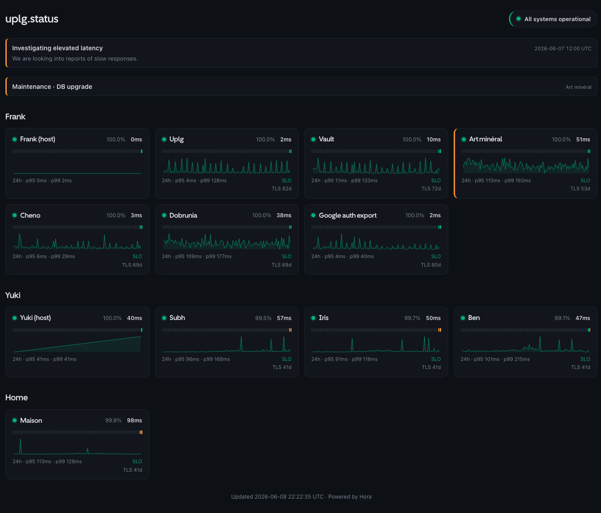

# Hora

[](https://github.com/uplg/hora/actions/workflows/ci.yml)
[](https://github.com/uplg/hora/pkgs/container/hora)
[](LICENSE)


A tiny, self-hosted uptime monitor written in Rust. One small binary probes your
services, stores history in SQLite, alerts you when something breaks (or a TLS
certificate is about to expire), and serves a server-rendered status page plus a
JSON API. The Docker image is a static musl binary on Alpine - about 15 MB.

Named after the **Horai**, the Greek goddesses of the hours.



## Features

- **HTTP, TCP, ICMP, DNS, push & assertion probes** - per-monitor interval, timeout,
  expected status and a "degraded if slower than" threshold. Failed probes are
  **retried once** before anything is recorded (`probe_retries`), so a one-off
  network blip never pollutes the history or the error budget - and every failure
  that survives its retry is logged with its reason and shown as a **tooltip on
  the status dot** (plus `last_error` in the API). HTTP monitors can assert
  a **keyword** in the body or a **JSONPath** (`json_query` / `json_expected`), route
  through an HTTP/SOCKS **proxy**, and send custom headers. **ICMP** (ping) monitors
  use an unprivileged datagram socket - no `CAP_NET_RAW`, rootless-Docker friendly,
  IPv4 and IPv6. **DNS** monitors resolve a hostname (any record type, custom
  resolver) and can **pin the expected answer** (`dns_expected`) - hijack detection.
  **Push** (heartbeat) monitors flip to down when a job stops pinging
  `/api/push/{id}` - or, with a **cron schedule** (`schedule = "0 3 * * *"` +
  `grace_secs`), only when a scheduled run misses its grace window: the natural
  fit for nightly backups, à la Healthchecks.io.
- **Dependency-aware topology** - cluster monitors into named **groups** on the status
  page, and declare upstreams with `depends_on`. When a monitor goes down its alert is
  annotated with root cause vs. symptom: _"caused by X"_ when an upstream it depends on
  is also down, or _"impacts: A, B, C"_ (the blast radius) when its upstreams are all
  healthy and it is the root cause. The dependency graph is validated acyclic at load.
- **Root-cause alert grouping** - when a database takes ten services down with it,
  you get **one notification** (the root cause, with its blast radius), not eleven:
  dependent monitors confirmed down within the grouping window fold into their
  upstream's alert, and their recoveries stay silent too. A monitor that flaps
  inside the window sends nothing at all. Tunable via `alerts.group_window_secs`
  (0 restores one-alert-per-monitor).
- **Availability SLOs with error budgets & burn-rate alerts** - give a monitor
  `slo_uptime = 99.9` and the status page shows the **error budget left** for the
  window ("budget 21m of 43m left, 30d"). Alerting is Google-SRE style
  **multi-window burn rate** - _"burning error budget at 14.4x (1h) - exhausted in
  ~6h at this rate"_ - which catches slow-burning flapping that a binary down alert
  never confirms, and stays quiet once the burn stops.
- **Server-rendered status page** (no JavaScript framework): a compact, responsive
  grid - daily uptime bars, an inline SVG latency chart, **p95/p99 latency** with an
  optional **latency SLO** indicator, plus an **incidents/announcements** banner.
- **JSON API** to read status and latency history from anywhere, with a generated
  **OpenAPI 3.1** document at `/api/openapi.json`.
- **Automatic incident history** - every confirmed down/up transition is recorded
  (with the root-cause annotation) and served as an **HTML history page**
  (`/history`) and an **Atom feed** (`/history.atom`) you can subscribe to - no
  account, no JavaScript.
- **Prometheus `/metrics`** - monitor status, 24h uptime ratio, latency quantiles
  and certificate expiry in text exposition format, ready for Grafana/Alertmanager.
- **Private monitors** - mark a monitor `public = false` and it disappears from the
  unauthenticated status page, API, badges and history; a viewer token
  (`server.auth_token`, sent as `Authorization: Bearer` or `?token=`) reveals the
  full view. Run one Hora for a public status page *and* your internal services.
- **Plain-text status for terminals** - `curl status.example.com` returns an
  aligned text rendering of the page (content negotiation on `User-Agent`/`Accept`).
- **TLS certificate expiry monitoring** with advance warnings, plus optional
  **public-key pinning** (`cert_pin`): an unexpected key change - MITM, botched
  renewal - alerts once per change, with the old and new fingerprints.
- **Pluggable notifications** via a `Notifier` trait - **Telegram, Discord, Slack,
  Matrix, ntfy, Gotify, Pushover, a generic JSON webhook, SMTP e-mail and Free
  Mobile SMS** built in. Channels
  are **named**, so you can have several of the same type and **route each monitor** to
  specific ones (`notify = [...]`). Delivery retries transient failures, and alerts fire
  only after _N_ consecutive failures (so flapping never wakes you up) and include a
  snippet of the failing response body. Optionally alert on _degraded_ too
  (`alert_on_degraded` - up, but slower than the monitor's `degraded_over_ms`).
- **Scheduled maintenance windows** that mute alerts (per monitor or global).
- **Per-IP API rate limiting** on the JSON endpoints, with a configurable trusted
  client-IP header (e.g. `cf-connecting-ip` behind Cloudflare).
- **Live config reload**: edit `config.toml` (or send `SIGHUP`) and monitors,
  thresholds, retention _and notification channels_ are reconciled in place -
  existing checks never pause, so there is no blind window.
- **Per-monitor retention** with automatic pruning **and long-term downsampling**:
  raw checks roll up into hourly buckets after 7 days and daily buckets after 90,
  kept for a year - the daily uptime bars keep working beyond the raw retention
  window, and the database still does not grow forever.
- **Uptime Kuma import** - `hora import kuma backup.json` converts a Kuma backup
  into Hora monitors (TOML on stdout): http/keyword/json-query, port, ping, dns and
  push monitors, keyword/JSONPath assertions, headers, intervals/timeouts, expected
  status codes, push tokens and Kuma groups (as display groups). Unsupported types
  come out as commented stubs. `hora check` validates a config with a CI-friendly
  exit code.
- **`${VAR}` interpolation** in the config so secrets stay in the environment.
- Single self-contained binary: migrations and templates are compiled in.

## Quick start (Docker)

```sh
mkdir -p hora-config && cp config.example.toml hora-config/config.toml
# edit hora-config/config.toml

docker run -d --name hora --restart unless-stopped \
  -p 8787:8787 \
  -v "$PWD/hora-config:/etc/hora" \
  -v hora-data:/data \
  ghcr.io/uplg/hora:latest
```

The status page is at `http://localhost:8787/`. Put it behind your reverse proxy
on whatever domain you like - Hora is self-contained and assumes nothing about who
consumes it.

**ICMP (`kind = "icmp"`) monitors** use an unprivileged datagram socket, so they
need no extra capability as long as the container's group id is within the
kernel's `net.ipv4.ping_group_range` - Docker's default (`0 2147483647`) already
covers the image's `10001` user, **including rootless Docker**. If your host
narrows that range, either widen it
(`--sysctl net.ipv4.ping_group_range="0 2147483647"`) or grant `--cap-add NET_RAW`;
otherwise `icmp` monitors simply report down with a clear reason.

Secrets are best kept in the environment: any `${VAR}` in the config is replaced
from the environment at load. So in the file:

```toml
[[channels]]
name = "ops"
type = "telegram"
token = "${HORA_TELEGRAM_TOKEN}"
chat_id = "123456"
```

and on the container: `-e HORA_TELEGRAM_TOKEN=123:abc`. Only `HORA_BIND`,
`HORA_DATABASE_PATH` and `HORA_CONFIG` are read directly from the environment.

## CLI

```sh
hora                                   # run the monitor
hora check                             # validate the config; non-zero exit on error (CI-friendly)
hora import kuma backup.json > out.toml  # convert an Uptime Kuma backup to Hora monitors
hora --version
```

`hora import kuma` maps http/keyword, port, ping, dns and push monitors;
anything else is emitted as a commented stub to review by hand.

## Upgrade

```sh
docker pull ghcr.io/uplg/hora:latest
docker stop hora && docker rm hora
docker run -d --name hora --restart unless-stopped \
  -p 8787:8787 \
  -v "$PWD/hora-config:/etc/hora" \
  -v hora-data:/data \
  ghcr.io/uplg/hora:latest
```

Your history lives on the `hora-data` volume and survives upgrades.
Version-specific notes (0.4 is a no-breaking-changes upgrade) are in
[`UPGRADES.md`](UPGRADES.md).

## Configuration & live reload

See [`config.example.toml`](config.example.toml) for every option. The file is
read from `$HORA_CONFIG` (default `./config.toml`).

To add, remove or change a monitor **without downtime**, just edit the config:

- **Bare metal / mounted directory:** Hora watches the file and reloads
  automatically.
- **Anywhere:** `kill -HUP <pid>` - or in Docker, `docker kill -s HUP hora`.

On reload, unchanged monitors keep running untouched; only new/removed/changed
ones are started or stopped, and the notification channels are rebuilt - so
adding a Telegram token takes effect live too. Only `server.bind` and the API
rate-limit settings are read once at startup and still require a restart.

## JSON API

| Endpoint | Description |
| --- | --- |
| `GET /` | The HTML status page - or an aligned plain-text rendering for curl/wget. |
| `GET /metrics` | Prometheus metrics (text exposition format). |
| `GET /history` | Incident history page (HTML). |
| `GET /history.atom` | Incident history as an Atom feed. |
| `GET /api/summary` | All monitors: status, 24h uptime (per-mille), p50/p95/p99 latency, cert days left, daily history; plus active incidents. |
| `GET /api/monitors/{id}/latency?hours=24` | Latency samples `[{ "t", "latency_ms" }]` (404 if unknown). |
| `POST /api/push/{id}?token=…` | Record a heartbeat for a push monitor. The token may instead be sent as an `X-Push-Token` header, keeping it out of proxy access logs. Optional `status=up\|down\|degraded`, `msg`, `ping`. 401 on a wrong token, 404 if not a push monitor. |
| `GET /api/badge/{id}/status` | Embeddable SVG status badge for a monitor. |
| `GET /api/badge/{id}/uptime` | Embeddable SVG 24h-uptime badge for a monitor. |
| `GET /api/openapi.json` | The OpenAPI 3.1 spec, generated from the code (`utoipa`). |
| `GET /healthz` | Liveness probe. |

The `/api/*` endpoints (summary, latency, push) are **rate-limited per client IP**
(configurable; read once at startup) and send `x-ratelimit-*` / `retry-after`
headers; the badges and `/api/openapi.json` are not. The client IP is taken from
`X-Forwarded-For` / `X-Real-IP` by default, so run Hora behind a proxy that sets
it - a direct client could otherwise spoof it. Behind Cloudflare, set
`server.client_ip_header = "cf-connecting-ip"` and lock the origin to Cloudflare.
`allowed_origins` controls CORS (empty = allow any, since the data is read-only and
public). Responses carry a strict CSP, `X-Content-Type-Options: nosniff` and
`X-Frame-Options: DENY`, plus an `x-request-id` (an inbound one is honoured,
otherwise a fresh id is minted) echoed on the response for log correlation.

Point any client (Bruno, Insomnia, Scalar, Swagger Editor…) at `/api/openapi.json`.

With `server.auth_token` set, the page, `/api/summary`, `/api/monitors/{id}/latency`,
`/metrics`, `/history` and `/history.atom` accept the token (as
`Authorization: Bearer <token>` or `?token=`) to include monitors marked
`public = false`; without it they serve the public subset only.

### Badges

Embed a monitor's live status and 24h uptime in a README, by its config `id`:

```md


```

Flat shields-style SVGs: green when up / uptime is high, amber for minor
incidents, red for an outage. A 404 is returned for an unknown id.

## Architecture

A small Cargo workspace:

- **`hora-notify`** - the `Notifier` trait, `Event` type, `Dispatcher`, and the
  Telegram / Discord / Slack / webhook / SMTP implementations. Add a channel by
  implementing the trait.
- **`hora-core`** - configuration, probing, SQLite storage, TLS-expiry checks, the
  per-monitor scheduler, and the supervisor that owns live config + reconciles
  monitor tasks on reload.
- **`hora-web`** - the axum router, view model and Askama status page template.
- **`hora`** - the binary that wires it all together.

## Development

```sh
cargo test --workspace
cargo clippy --workspace --all-targets -- -D warnings
cargo fmt --all -- --check
cargo deny check

# run locally
cp config.example.toml config.toml   # then edit
cargo run -p hora
```

Requires a C toolchain + `cmake` (for `aws-lc-rs`, the rustls crypto provider).

## License

MIT - see [LICENSE](LICENSE).

The status page embeds the [Cal Sans](https://github.com/calcom/font) font, used
under the SIL Open Font License - see
[`crates/hora-web/assets/OFL.txt`](crates/hora-web/assets/OFL.txt).
