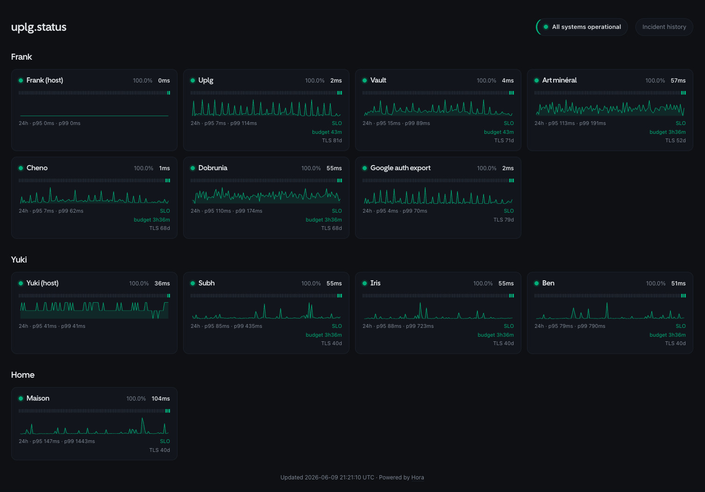

# Hora

[](https://github.com/uplg/hora/actions/workflows/ci.yml)
[](https://github.com/uplg/hora/pkgs/container/hora)
[](LICENSE)


A tiny, self-hosted uptime monitor written in Rust. One small binary probes your
services, stores history in SQLite, alerts you when something breaks (or a TLS
certificate is about to expire), and serves a server-rendered status page plus a
JSON API. The Docker image is a static musl binary on Alpine - about 15 MB.

Named after the **Horai**, the Greek goddesses of the hours.

**Documentation: [uplg.github.io/hora](https://uplg.github.io/hora/)** - guides,
CLI & API reference, and the roadmap. (Source in [`docs/`](docs/), built with
Starlight and deployed by the [Docs workflow](.github/workflows/docs.yml).)



## Features

Full guides for everything below live in the
[documentation](https://uplg.github.io/hora/).

**Probing**

- **HTTP, TCP, ICMP, DNS & push probes** - per-monitor interval, timeout,
  expected status, "degraded if slower than" threshold. Failures are retried
  before anything is recorded, so a one-off blip never pollutes the history.
- **Assertions** - keyword or JSONPath (`json_query`) against the body; custom
  headers and HTTP/SOCKS proxies.
- **Dual-stack verification** - probe IPv4 *and* IPv6 and require both: catches
  the service whose IPv6 has been silently dead for weeks behind a healthy IPv4.
- **Cron-aware heartbeats** - a push monitor with `schedule = "0 3 * * *"` alerts
  only when a scheduled run misses its grace window, à la Healthchecks.io.
- **TLS expiry warnings & public-key pinning** - know two weeks ahead, and catch
  the unexpected key change (MITM, botched renewal).
- Unprivileged **ICMP** (no `CAP_NET_RAW`), rootless-Docker friendly; **DNS**
  answer pinning for hijack detection.

**Alerting that never cries wolf**

- **Down only after N consecutive failures**; degraded alerts opt-in.
- **Root-cause grouping** - a database taking ten services down sends **one**
  notification, annotated _"caused by X"_ / _"impacts: A, B, C"_ via `depends_on`.
- **SLOs & error budgets** - `slo_uptime = 99.9` shows the budget left and arms
  Google-SRE **multi-window burn-rate alerts** ("burning at 14.4x - exhausted in ~6h").
- **Ten notification backends** - Telegram, Discord, Slack, Matrix, ntfy, Gotify,
  Pushover, e-mail, Free Mobile SMS, generic webhook - named channels, per-monitor
  routing, delivery retries.
- **Maintenance windows** and **ad-hoc silences** (`hora silence api,web 10m` or
  `POST /api/silence` from a deploy hook).

**Status page, API & history**

- **Server-rendered status page** (no JS framework) - uptime bars, latency charts,
  p95/p99, banners - and an aligned **plain-text rendering** when you `curl` it.
- **JSON API** with a generated **OpenAPI 3.1** spec, **Prometheus `/metrics`**,
  embeddable **SVG badges**.
- **Incident history** as HTML and an **Atom feed**, with **failure snapshots**
  (what the service actually answered) and **operator annotations**
  (`hora annotate 42 "fiber cut"`).
- **Private monitors** behind a viewer token - one Hora for a public status page
  *and* your internal services. Per-IP API rate limiting.

**Operations**

- **Live config reload** (file watch or `SIGHUP`) with no blind window; `${VAR}`
  interpolation keeps secrets in the environment.
- **Retention with downsampling** - hourly buckets after 7 days, daily after 90,
  kept a year; the database never grows forever. `hora backup` snapshots it in
  one statement.
- **Uptime Kuma import** (`hora import kuma backup.json`), `hora check` for CI,
  `hora test-alert` to verify the notification chain before the first incident.
- Single self-contained binary - migrations and templates compiled in.

## Quick start (Docker)

```sh
mkdir -p hora-config && cp config.example.toml hora-config/config.toml
# edit hora-config/config.toml

docker run -d --name hora --restart unless-stopped \
  -p 8787:8787 \
  -v "$PWD/hora-config:/etc/hora" \
  -v hora-data:/data \
  ghcr.io/uplg/hora:latest
```

The status page is at `http://localhost:8787/`. Put it behind your reverse proxy
on whatever domain you like - Hora is self-contained and assumes nothing about who
consumes it.

**ICMP (`kind = "icmp"`) monitors** use an unprivileged datagram socket, so they
need no extra capability as long as the container's group id is within the
kernel's `net.ipv4.ping_group_range` - Docker's default (`0 2147483647`) already
covers the image's `10001` user, **including rootless Docker**. If your host
narrows that range, either widen it
(`--sysctl net.ipv4.ping_group_range="0 2147483647"`) or grant `--cap-add NET_RAW`;
otherwise `icmp` monitors simply report down with a clear reason.

Secrets are best kept in the environment: any `${VAR}` in the config is replaced
from the environment at load. So in the file:

```toml
[[channels]]
name = "ops"
type = "telegram"
token = "${HORA_TELEGRAM_TOKEN}"
chat_id = "123456"
```

and on the container: `-e HORA_TELEGRAM_TOKEN=123:abc`. Only `HORA_BIND`,
`HORA_DATABASE_PATH` and `HORA_CONFIG` are read directly from the environment.

## CLI

```sh
hora                                   # run the monitor
hora check                             # validate the config; non-zero exit on error (CI-friendly)
hora test-alert                        # send a test down + recovered through every channel
hora test-alert website                # ... through the channels routed for monitor "website"
hora silence api,web 10m "deploying"   # mute alerts ad hoc (checks keep recording)
hora silence list                      # show the active silences
hora silence clear                     # remove every silence
hora incidents                         # list recent incidents with their ids
hora annotate last "fiber cut"         # attach a note to an incident (shown on /history)
hora backup /mnt/nas/hora-backup.db    # consistent snapshot of the database (VACUUM INTO)
hora import kuma backup.json > out.toml  # convert an Uptime Kuma backup to Hora monitors
hora --version
```

`hora test-alert` verifies your notification chain *before* the first real
incident: it sends a clearly-labelled test alert (and its recovery) through the
real dispatch path - with a monitor id, exactly the channels its `notify`
routing would fire - and any channel that fails logs a warning saying why
("chat not found", HTTP 403, ...).

`hora silence` mutes alerts for some monitors (or `all`) for a duration like
`10m` or `1h30m` (max 7 days) - the scriptable, ad-hoc counterpart of a
configured `[[maintenance]]` window, made for deploy hooks. Checks keep being
recorded; only the alerting is muted. The same action is available over HTTP
as `POST /api/silence` for CI pipelines.

`hora annotate <id|last> "<note>"` attaches a free-form note to an incident
("fiber cut, ETA 6pm"), displayed on `/history` and in the Atom feed - notes
are written for visitors and shown to anonymous viewers too. An empty note
clears it; `hora incidents` lists recent incidents with their ids.

`hora backup <dest>` snapshots the database with SQLite's `VACUUM INTO`:
consistent and compacted, safe while the daemon is running, and a one-liner in
a cron job pointed at a NAS mount.

`hora import kuma` maps http/keyword, port, ping, dns and push monitors;
anything else is emitted as a commented stub to review by hand.

## Upgrade

```sh
docker pull ghcr.io/uplg/hora:latest
docker stop hora && docker rm hora
docker run -d --name hora --restart unless-stopped \
  -p 8787:8787 \
  -v "$PWD/hora-config:/etc/hora" \
  -v hora-data:/data \
  ghcr.io/uplg/hora:latest
```

Your history lives on the `hora-data` volume and survives upgrades.
Version-specific notes (0.4 is a no-breaking-changes upgrade) are in
[`UPGRADES.md`](UPGRADES.md).

## Configuration & live reload

See [`config.example.toml`](config.example.toml) for every option. The file is
read from `$HORA_CONFIG` (default `./config.toml`).

To add, remove or change a monitor **without downtime**, just edit the config:

- **Bare metal / mounted directory:** Hora watches the file and reloads
  automatically.
- **Anywhere:** `kill -HUP <pid>` - or in Docker, `docker kill -s HUP hora`.

On reload, unchanged monitors keep running untouched; only new/removed/changed
ones are started or stopped, and the notification channels are rebuilt - so
adding a Telegram token takes effect live too. Only `server.bind` and the API
rate-limit settings are read once at startup and still require a restart.

## JSON API

| Endpoint | Description |
| --- | --- |
| `GET /` | The HTML status page - or an aligned plain-text rendering for curl/wget. |
| `GET /metrics` | Prometheus metrics (text exposition format). |
| `GET /history` | Incident history page (HTML). |
| `GET /history.atom` | Incident history as an Atom feed. |
| `GET /api/summary` | All monitors: status, 24h uptime (per-mille), p50/p95/p99 latency, cert days left, daily history; plus active incidents. |
| `GET /api/monitors/{id}/latency?hours=24` | Latency samples `[{ "t", "latency_ms" }]` (404 if unknown). |
| `POST /api/push/{id}` | Record a heartbeat for a push monitor. Send the token as an `X-Push-Token` header (preferred - it stays out of proxy access logs) or as `?token=…`. Optional `status=up\|down\|degraded`, `msg`, `ping`. 401 on a wrong token, 404 if not a push monitor. |
| `POST /api/silence?monitors=api,web&duration=10m` | Mute alerts ad hoc (deploy hook): `monitors` is a comma-separated id list or `all`, `duration` like `10m`/`1h30m` (max 7d), optional `reason`. **Requires `server.auth_token`** (as `Authorization: Bearer` or `?token=`); without one configured the endpoint is closed. |
| `GET /api/badge/{id}/status` | Embeddable SVG status badge for a monitor. |
| `GET /api/badge/{id}/uptime` | Embeddable SVG 24h-uptime badge for a monitor. |
| `GET /api/openapi.json` | The OpenAPI 3.1 spec, generated from the code (`utoipa`). |
| `GET /healthz` | Liveness probe. |

The `/api/*` endpoints (summary, latency, push) are **rate-limited per client IP**
(configurable; read once at startup) and send `x-ratelimit-*` / `retry-after`
headers; the badges and `/api/openapi.json` are not. The client IP is taken from
`X-Forwarded-For` / `X-Real-IP` by default, so run Hora behind a proxy that sets
it - a direct client could otherwise spoof it. Behind Cloudflare, set
`server.client_ip_header = "cf-connecting-ip"` and lock the origin to Cloudflare.
`allowed_origins` controls CORS (empty = allow any, since the data is read-only and
public). Responses carry a strict CSP, `X-Content-Type-Options: nosniff` and
`X-Frame-Options: DENY`, plus an `x-request-id` (an inbound one is honoured,
otherwise a fresh id is minted) echoed on the response for log correlation.

Point any client (Bruno, Insomnia, Scalar, Swagger Editor…) at `/api/openapi.json`.

With `server.auth_token` set, the page, `/api/summary`, `/api/monitors/{id}/latency`,
`/metrics`, `/history` and `/history.atom` accept the token (as
`Authorization: Bearer <token>` or `?token=`) to include monitors marked
`public = false`; without it they serve the public subset only.

### Badges

Embed a monitor's live status and 24h uptime in a README, by its config `id`:

```md


```

Flat shields-style SVGs: green when up / uptime is high, amber for minor
incidents, red for an outage. A 404 is returned for an unknown id.

## Architecture

A small Cargo workspace:

- **`hora-notify`** - the `Notifier` trait, `Event` type, `Dispatcher`, and the
  Telegram / Discord / Slack / webhook / SMTP implementations. Add a channel by
  implementing the trait.
- **`hora-core`** - configuration, probing, SQLite storage, TLS-expiry checks, the
  per-monitor scheduler, and the supervisor that owns live config + reconciles
  monitor tasks on reload.
- **`hora-web`** - the axum router, view model and Askama status page template.
- **`hora`** - the binary that wires it all together.

## Development

```sh
cargo test --workspace
cargo clippy --workspace --all-targets -- -D warnings
cargo fmt --all -- --check
cargo deny check

# run locally
cp config.example.toml config.toml   # then edit
cargo run -p hora
```

Requires a C toolchain + `cmake` (for `aws-lc-rs`, the rustls crypto provider).

## License

MIT - see [LICENSE](LICENSE).

The status page embeds the [Cal Sans](https://github.com/calcom/font) font, used
under the SIL Open Font License - see
[`crates/hora-web/assets/OFL.txt`](crates/hora-web/assets/OFL.txt).
